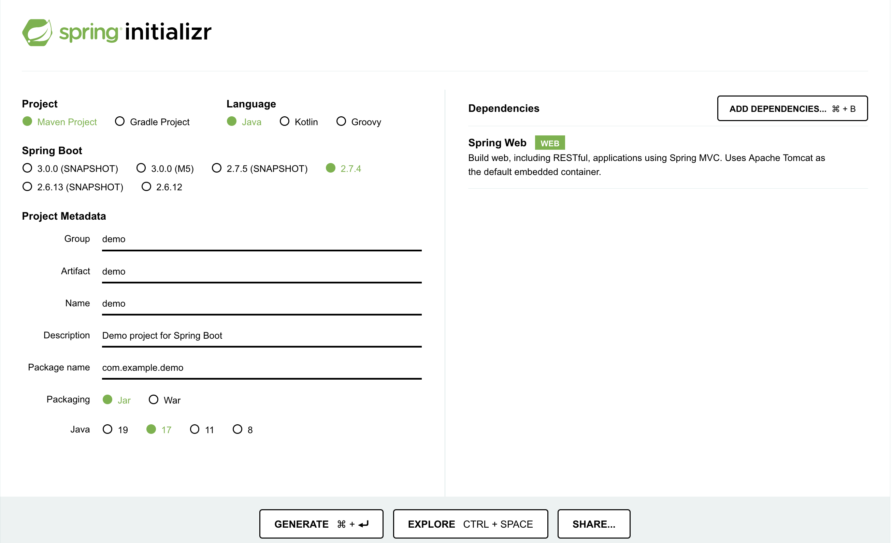
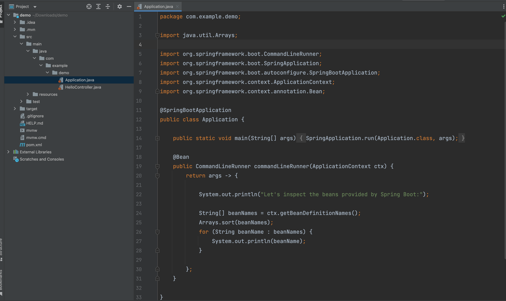
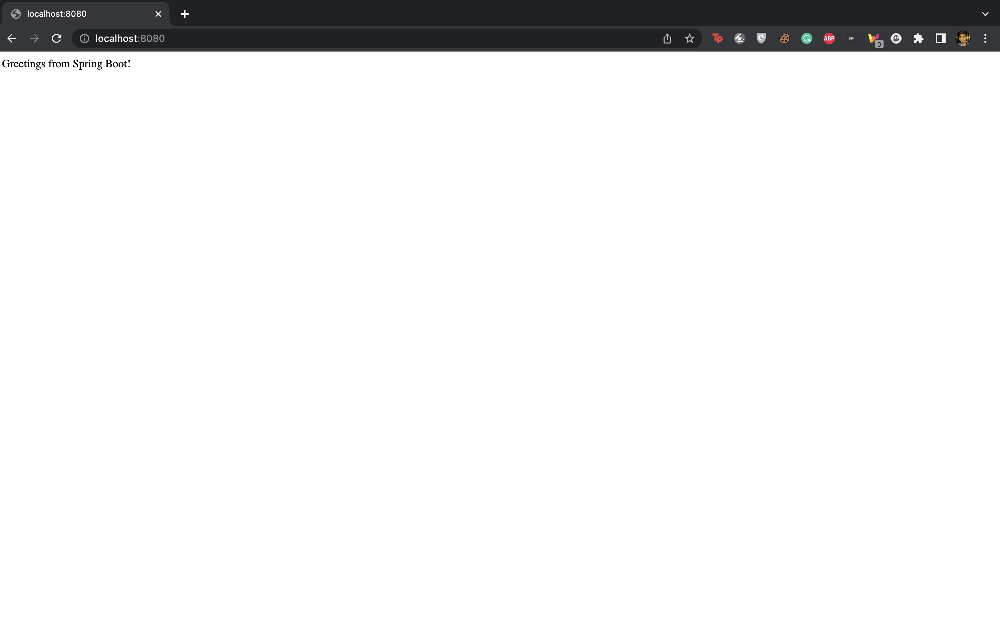

## Springboot demo application (CSE 687: Object Oriented Design)

In this demo we will build a hello world Springboot application, Springboot is a framework which is used to build Web applications and microservices, to know more about springboot visit [here](https://www.ibm.com/cloud/learn/java-spring-boot).

### Objective
Build a hello world app and make a HTTP GET request to http://localhost:8080/ to receive a response.
This simple exercise will help build all types of API's for more advanced projects like the one you all will be doing for the final.

### Requirements
 * JDK >= 1.8 [[Installation instructions]](https://www.oracle.com/java/technologies/downloads/)
 * Maven >= 3.2 [[Installation instructions]](https://maven.apache.org/download.cgi)

We will follow the official [Springboot documentation](https://spring.io/guides/gs/spring-boot/).

### Verify Installation
```
mvn --version && java --version
```
> 🔴 IMPORTANT❗🔴 Revisit installation guide if you encounter any issues! 

### IDE

Choose an IDE of your choice, I will recommend [IntelliJ by JetBrains](https://www.jetbrains.com/idea/download/), it has some really helpful features that makes development easy. Community edition(free) works just fine!

### Downloading Springboot boiler plate.

1. Visit https://start.spring.io/ and select the choices as indicated in the image below! and then click generate this download a .zip file. Carefully note that we are adding the spring web dependency! As we build on more advance projects we need to include more dependencies! ex. MongoDB, Junit etc.



2. Open the .zip file using IntelliJ

Refer to the 2 .java files provided inside projectArtifacts copy and place them inside **com/example/demo**




### Clean and Build
```
mvn clean package
```
Clean package before first run! standard practise.

> _The Maven Clean Plugin, as the name implies, attempts to clean the files and directories generated by Maven during its build. While there are plugins that generate additional files, the Clean Plugin assumes that these files are generated inside the target directory. It's a good practise if you are adding new dependncies and need a soft reboot for your application._

### Run
Command to run spring-boot application!

```
mvn spring-boot:run
open http://localhost:8080/
```

> If everything works well, you should be able to open the link on port 8080 and would be able to see a hello world message!



> Tip: Instead of using browser use postman to fire your API's!

### Debug

If you are facing any issues while running the application use the ```-X``` flag while running maven commands to get more details.

```
mvn spring-boot:run -X
```

### Test
```
mvn verify
```

## Using IntelliJ springboot initializer

If one wants to avoid the hassle of setting up the spring application, they can also simply use the spring initiazler feature inside IntelliJ, have a look at the [official video](https://www.youtube.com/watch?v=5kOGdZmpSDI)

> P.S. you do not need the IntelliJ ultimate edition to get the plugin, like mentioned in the video have a look at **[this video](https://www.youtube.com/watch?v=oO6HPVRqGvg)**, there might be other options as well, feel free to explore!

## Concluding notes

This simple tutorial covers only a ```GET``` operation, but project will require much more operations like ```PUT, DELETE, etc```. I will recommend a tutorial by [AMIGOSCODE](https://www.youtube.com/watch?v=VVn9OG9nfH0) this tutorial covers many basic CRUD operations and follows a lot of design patterns!


