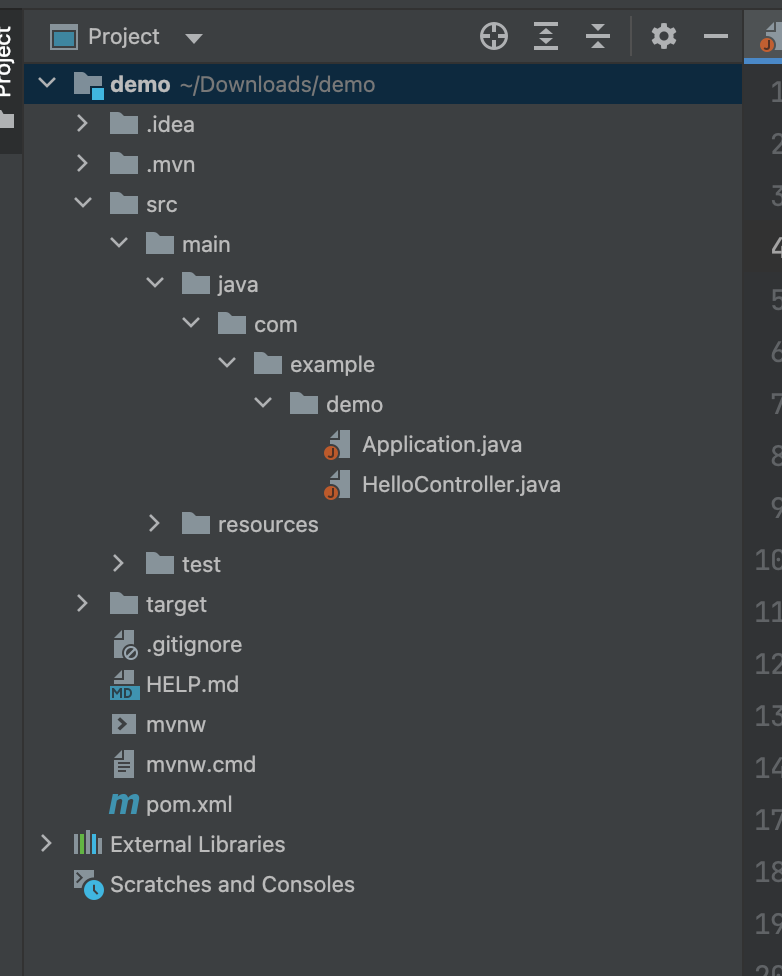

## Springboot demo application (CSE 687: Object Oriented Design)

In this demo we will build a hello world Springboot application, Springboot is a framework which is used to build Web applications and microservices, to know more about springboot visit [here](https://www.ibm.com/cloud/learn/java-spring-boot).

## Objective
Build a hello world app and make a HTTP GET request to http://localhost:8080/ to receive a response.
This simple exercise will help build all types of API's for more advanced projects like the one you all will be doing for the final.

## Requirements
 * JDK >= 1.8 [[Installation instructions]](https://www.oracle.com/java/technologies/downloads/)
 * Maven >= 3.2 [[Installation instructions]](https://maven.apache.org/download.cgi)

We will follow the official [Springboot documentation](https://spring.io/guides/gs/spring-boot/).

### Verify Installation
```
mvn --version && java --version
```
> Revisit installation guide if you encounter any issues!

### IDE

Choose an IDE of your choice, I will recommend [IntelliJ by JetBrains](https://www.jetbrains.com/idea/download/), it has some really helpful features that makes development easy. Community edition(free) works just fine!

### Downloading Springboot boiler plate.

1. Visit https://start.spring.io/ and select the choices as indicated in the image below! and then click generate this download a .zip file. Carefully note that we are adding the spring web dependency! As we build on more advance projects we need to include more dependencies! ex. MongoDB, Junit etc.


2. Open the .zip file using IntelliJ

Refer to the 2 .java files provided inside projectArtifacts copy and place them inside **com/example/demo**




#### Clean and Build
```
mvn clean package
```

#### Run
```
mvn spring-boot:run
open http://localhost:8080/
```

#### Test
```
mvn verify
```


